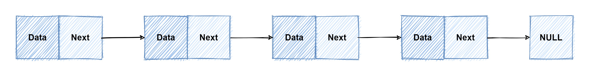
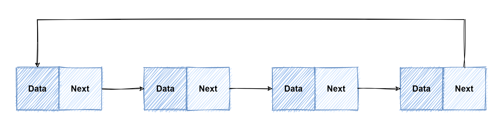
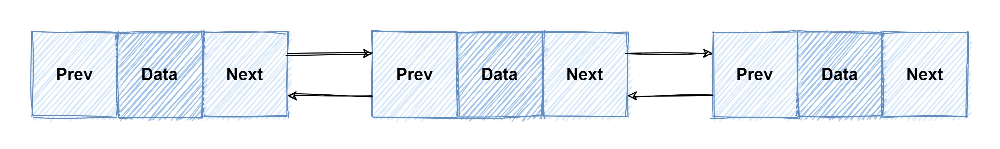

## 一、什么是链表
### 单链表
* 链表通过指针将零散的内存数据联系在一起
* 如下图所示，包含两个结构，一个是数据 data，另外一个是下一个节点的内存地址
* 最后一个节点指向 NULL

### 循环链表
* 和单链表的区别就是，将尾节点指向的头结点，将整个链表组成了一个环状

### 双向链表
* 和在单链表的基础之上添加了一个指向上一个节点的指针，这样我们知道任意一个节点就可以同时知道他们的上下两个节点
  这是实际使用的时候最常用的


## 二、和数组对比
|               | 链表    | 数组    |
|:-------------:|-------|-------|
|    查找某个元素     | O(n)  | O(1)  |
|  删除或者添加一个元素	  | O(1)  | O(n)  |


## 三、标准库 Container/list 的实现
### 1、结构体的定义
> 标准库中主要是两个结构体，分别为 `Element`，`List`。
> 其中 `Element`表示节点；`List` 表示列表
``` golang
// Element 用于表示链表当中的节点
type Element struct {
    // next, prev 分别表示上个节点和下个节点
    next, prev *Element

    // 表示节点所在的链表
    list *List

    // 节点所保存的数据，也就是上面图中的 data
    Value interface{}
}

// List 这是一个双向链表
// List 的零值是一个空链表
type List struct {
    // root 表示根节点
    // List 其实是一个双向循环链表。 root.prev 是指向尾节点；尾节点的下一个节点next.node指向 root
    // 根节点是一个哨兵节点，是为了用来简化节点操作使用的
    root Element

    // 链表的长度，不包括哨兵节点，也就是根节点
    len  int
}
```
### 2、方法集
``` golang
Remove(e *Element) interface{} // 删除一个节点
PushFront(v interface{}) *Element // 将值插入到链表头部
PushBack(v interface{}) *Element // 将值插入到链表尾部
InsertBefore(v interface{}, mark *Element) *Element // 在 mark 节点之前插入值
InsertAfter(v interface{}, mark *Element) *Element // 在 mark 节点之后插入值
MoveToFront(e *Element) // 将节点 e 移动至链表头部
MoveToBack(e *Element) // 将节点 e 移动至链表尾部
MoveBefore(e, mark *Element) // 将节点 e 移动到 mark 节点之前
MoveAfter(e, mark *Element) // 将节点 e 移动到 mark 节点之后
PushBackList(other *List) // 将链表 other 连接到当前链表之后
PushFrontList(other *List) // 将链表 other 连接到当前链表之前
``` 
以上是暴露的方法集，接下来是标准库中核心的几个方法，***上诉暴露的方法实质上都是通过调用下面的方法实现的***。

### 3、核心方法
#### a、insert 新增
``` go
// 将节点 e 插入 at 之后
func (l *List) insert(e, at *Element) *Element {
    // 假设 at.next 为 nt
    // 1. 将节点 e 的上一个节点指向 at
    e.prev = at
    // 2. 将节点 e 的下一个节点指向 nt
    e.next = at.next
    // 3. 这个时候  e.prev.next == at.next
    // 其实就是本来 at --> nt，修改为 at --> e
    e.prev.next = e
    // 4. e.next.prev == nt.prev
    // 本来 at <--- nt，修改为 e <--- nt
    e.next.prev = e
    e.list = l
    l.len++
    return e
}
``` 
#### b、remove 移除
``` go
// remove removes e from its list, decrements l.len, and returns e.
func (l *List) remove(e *Element) *Element {
    e.prev.next = e.next
    e.next.prev = e.prev
    // 这里为了避免内存泄漏的操作可以学习
    e.next = nil // avoid memory leaks
    e.prev = nil // avoid memory leaks
    e.list = nil
    l.len--
    return e
}
```
#### b、remove 移动
``` go
// move moves e to next to at and returns e.
func (l *List) move(e, at *Element) *Element {
    if e == at {
    return e
    }
    // 先把当前节点从原来的位置移除
    e.prev.next = e.next
    e.next.prev = e.prev

    // 再将当前节点 e 插入到 at 节点之后
	e.prev = at
	e.next = at.next
	e.prev.next = e
	e.next.prev = e

	return e
}
```
### 4、疑问点
> 1. 为什么在 Element 当中会持有一个 List 结构？
> 查看上方的 move 方法我们就可以知道，list 提供了将节点移动到某个节点之后的方法，通过 e.List 进行对比我们就可以知道需要移动的节点是不是属于当前这个链表了， 这也是 MoveToFront 等方法的实现方式
```
func (l *List) MoveToFront(e *Element) {
    if e.list != l || l.root.next == e {
        return
    }
    // see comment in List.Remove about initialization of l
    l.move(e, &l.root)
}
```
> 2. 为什么需要一个单独的 List 结构体，直接要一个 Root  节点不就完事了么？
> 看之前的 List 的结构我们可以发现，在结构体中包含了一个 len ，这样可以避免需要取长度的时候每次都需要从头到尾遍历一遍

### 5、实现并发安全的链表
> 参考 concurrency_sync.go 文件

### 6、实现一个 LRU 缓存
> LRU: Least Recently Used 最近最少使用策略
> 参考 lru.go 文件